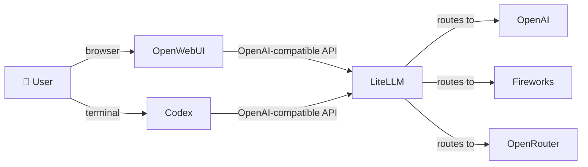

# My Intelligence Stack

A portable, Docker-based AI stack combining LiteLLM (model gateway), OpenWebUI (chat frontend), and Codex (agent CLI), backed by OpenRouter, Fireworks, and OpenAI.

## What this packages

| Layer | Tool | Purpose |
|-------|------|---------|
| Frontend | OpenWebUI | Web-based chat UI |
| Gateway | LiteLLM | Routes models across providers, logs spend |
| Agent CLI | Codex | Terminal-based coding assistant |
| Inference | OpenRouter / Fireworks / OpenAI | Model providers |

## Architecture



## Quick start

**One-liner:**

```bash
curl -fsSL https://raw.githubusercontent.com/asaini/openmodelstack/main/install.sh | bash
```

**Or clone and run locally:**

```bash
git clone https://github.com/asaini/openmodelstack.git
cd openmodelstack
./install.sh
```

The installer will:
1. Check for Docker
2. Create `.env` from `.env.example` and prompt for API keys
3. Generate random internal secrets (Postgres, LiteLLM master key, WebUI secret)
4. Copy the Codex config to `~/.codex/config.toml` (skips if one already exists)
5. Start all services via Docker Compose

After it finishes, open `http://localhost:3000` for the chat UI.

## Services

- **OpenWebUI** → `http://localhost:3000`
- **LiteLLM API** → `http://localhost:4000/v1` (OpenAI-compatible)
- **LiteLLM Admin UI** → `http://localhost:4000/ui`

## Configuration

- **LiteLLM model routing**: `config/litellm/config.yaml`
- **Codex model provider**: `config/codex/config.toml`
- **Secrets and API keys**: `.env` (not committed to git)

## For Codex users

The installer copies a minimal `config.toml` to `~/.codex/config.toml` that points Codex at your local LiteLLM proxy. You'll need:

```bash
export LITELLM_API_KEY="<your LITELLM_MASTER_KEY from .env>"
```

Add that to your shell profile. If you already have a Codex config, the installer won't overwrite it — merge the `[model_providers.litellm]` section manually.

Launch Codex with its configured default model:

```bash
codex
```

Or select any model exposed by LiteLLM without changing your default:

```bash
codex -m z-ai/glm-5.3-flash
```

The value passed to `-m` must match the `model_name` in `config/litellm/config.yaml`. Models are added there; `config/codex/config.toml` only defines the provider connection and your default model.

## Stopping / restarting

```bash
docker compose down      # stop services
docker compose up -d    # restart
docker compose logs -f  # follow logs
```
